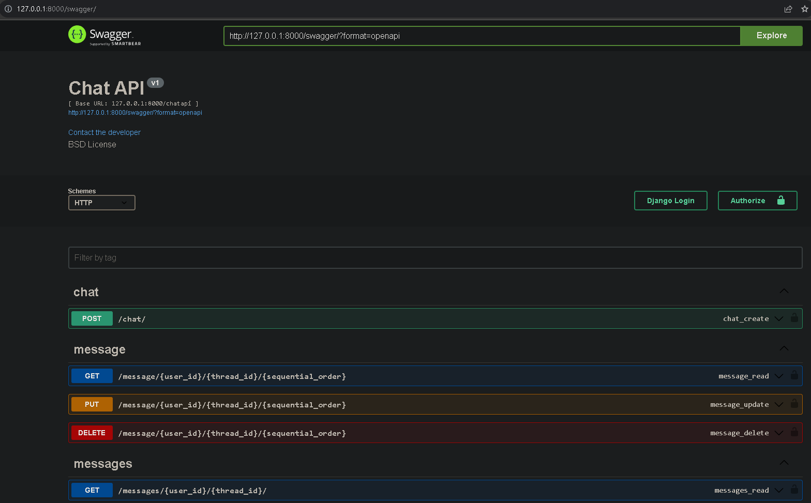
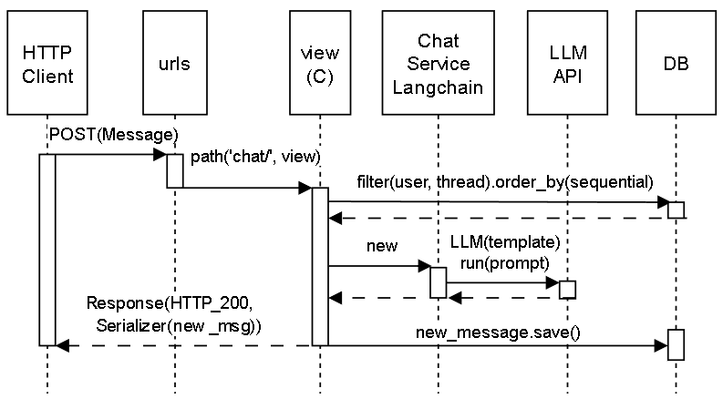
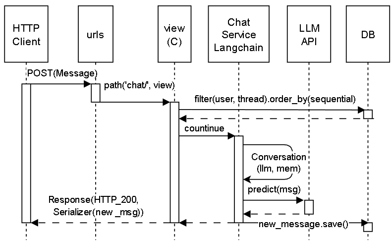
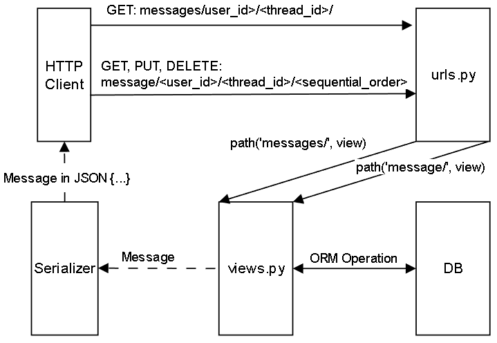

# LangDjango

## 1. Setup Environment:
- install requirements.txt
    ```
    pip install -r requirements.txt
    ```
- add .env file to root folder
- copy and paste the COHERE API Key into .env file
    ```
    COHERE_API_KEY='YOUR_COHERE_API_KEY'
    ```
- migrate the database
    ```
    python manage.py makemigrations
    python manage.py migrate
    ```  
## 2. Run the server:
- run the server
    ```
    python manage.py runserver
    ```
  
## 3. Run the test:
- run the test
    ```
    python manage.py test chatapi/tests/
    ```
  
## 4. API Documentation and Endpoints:
- After launch the server, the API Documentation and Endpoints can be accessed at:
- API Documentation: http://127.0.0.1:8000/swagger/
- picture:
    

## 5. System Design and Sequence Diagrams:
- New Chat Message Sequence Diagram:
    
- Continuing Chat Message Sequence Diagram:
    
- Get, Update, Delete Chat Message Sequence Diagram:
    
